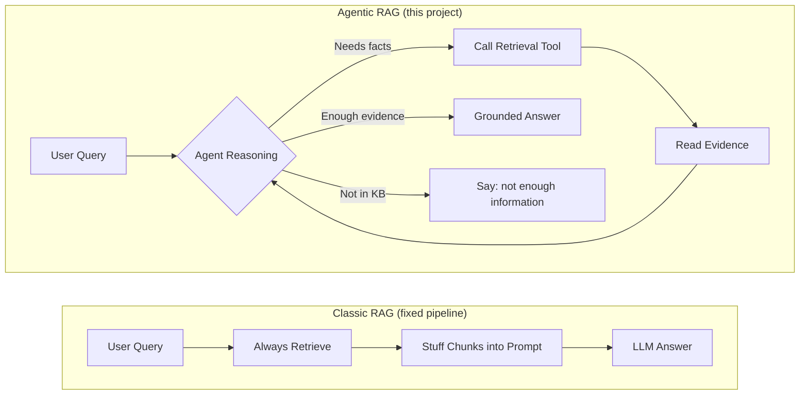
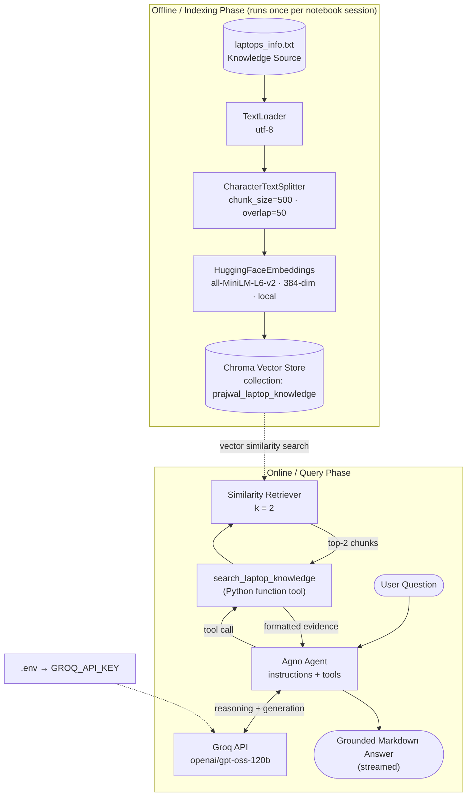
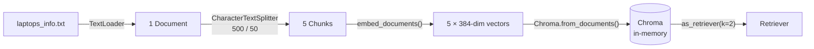
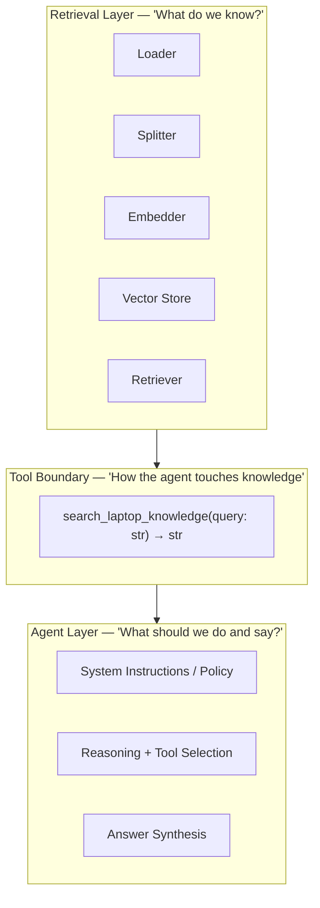
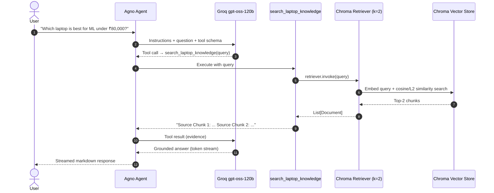
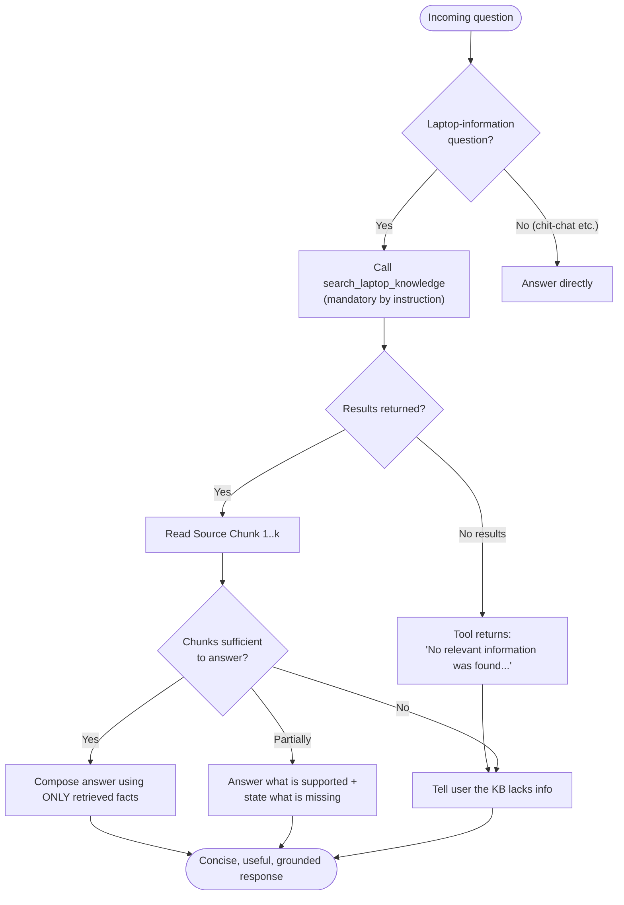
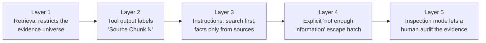
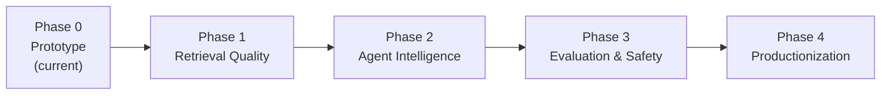
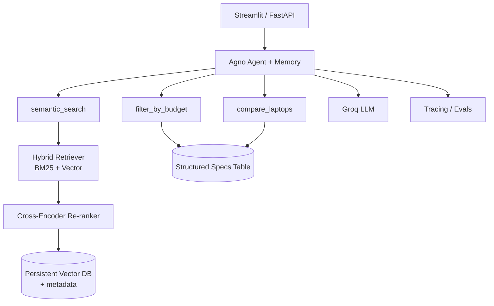

# Agentic RAG with Groq - Laptop Knowledge Assistant

> **From "retrieve then answer" to "an agent that decides to retrieve, reads the evidence, and answers only from it."**

An Agentic Retrieval-Augmented Generation (RAG) system built on a local laptop knowledge base (`laptops_info.txt`). A **Groq-hosted `openai/gpt-oss-120b` agent**, orchestrated by **Agno**, calls a **Chroma-backed retrieval tool** and produces grounded, hallucination-resistant answers about laptops for AI/ML work.

---


https://github.com/user-attachments/assets/096adf9e-9662-4080-be76-5326d15db438


## Table of Contents

1. [Project Overview](#1-project-overview)
2. [Classic RAG vs Agentic RAG](#2-classic-rag-vs-agentic-rag)
3. [System Architecture](#3-system-architecture)
4. [End-to-End Query Flow (Sequence)](#4-end-to-end-query-flow-sequence)
5. [Agent Decision Logic](#5-agent-decision-logic)
6. [Tech Stack](#6-tech-stack)
7. [Repository Structure](#7-repository-structure)
8. [The Knowledge Base](#8-the-knowledge-base)
9. [Setup & Installation](#9-setup--installation)
10. [Notebook Walkthrough (Cell by Cell)](#10-notebook-walkthrough-cell-by-cell)
11. [Configuration Reference](#11-configuration-reference)
12. [Design Decisions & Why](#12-design-decisions--why)
13. [Grounding & Anti-Hallucination Strategy](#13-grounding--anti-hallucination-strategy)
14. [Example Questions](#14-example-questions)
15. [Retrieval Inspection Mode](#15-retrieval-inspection-mode)
16. [Known Limitations](#16-known-limitations)
17. [Roadmap: Making It Production-Grade](#17-roadmap-making-it-production-grade)
18. [Troubleshooting](#18-troubleshooting)

---

## 1. Project Overview

This project answers questions such as:

- *"Which laptop is best for machine learning under ₹80,000?"*
- *"Which is better for AI workloads, HP Victus 15 or Lenovo IdeaPad Gaming 3?"*
- *"Which laptops have 16GB RAM and an NVIDIA GPU?"*

**without letting the LLM invent specs, prices, or benchmarks.**

It is built in two deliberately separated layers:

| Layer | Responsibility | Components |
|---|---|---|
| **Retrieval layer** | Turn raw text into searchable semantic memory | `TextLoader` → `CharacterTextSplitter` → HuggingFace embeddings → Chroma → Similarity retriever |
| **Agent layer** | Decide when to retrieve, reason over evidence, write the answer | Agno `Agent` + Groq `gpt-oss-120b` + `search_laptop_knowledge` tool |

The core engineering principle:

> **First prove retrieval works on its own. Only then hand it to an agent as a tool.**

The notebook follows this order exactly: it verifies the retriever with a raw query *before* the agent is created.

---

## 2. Classic RAG vs Agentic RAG



| Aspect | Classic RAG | Agentic RAG (this project) |
|---|---|---|
| Who controls retrieval? | Hard-coded pipeline | **The agent** decides |
| Retrieval is a… | Mandatory step | **Tool** the model can call |
| Query formulation | User's raw text | Agent can **rewrite** the query for the tool |
| Multiple retrievals | No | **Possible** (agent can call the tool again) |
| "I don't know" behavior | Weak | **Explicit** via instructions |
| Extensibility | Re-wire pipeline | **Add more tools** |

---

## 3. System Architecture

### 3.1 High-level architecture



### 3.2 Indexing pipeline (detailed)



> From the notebook run: **1 loaded document → 5 chunks → 384-dimensional embeddings**.

### 3.3 Component responsibility map



The **tool function is the contract** between the two layers. The agent never touches Chroma directly; it only sees formatted text evidence. You can swap Chroma for pgvector, Qdrant, or Pinecone without touching the agent.

---

## 4. End-to-End Query Flow (Sequence)



---

## 5. Agent Decision Logic

The agent's behavior is governed by its instruction set. This is the decision tree those instructions induce:



### The agent's policy (verbatim intent of the instructions)

1. Act as an Agentic RAG assistant for the supplied laptop knowledge base.
2. **Search first** for any laptop-information question.
3. Treat retrieved chunks as the **source of truth**.
4. **Never invent** specifications, prices, benchmarks, availability, or features.
5. If the KB is insufficient, **say so clearly**.
6. When comparing laptops, use **only retrieved facts**.
7. Keep answers **concise but useful**.

---

## 6. Tech Stack

| Concern | Choice | Why |
|---|---|---|
| **Agent framework** | [Agno](https://github.com/agno-agi/agno) | Lightweight agent abstraction; plain Python functions become tools automatically |
| **LLM provider** | [Groq](https://groq.com) | Very low-latency inference, ideal for streaming agent loops |
| **LLM** | `openai/gpt-oss-120b` | Strong open-weight reasoning + tool-calling model |
| **Embeddings** | `sentence-transformers/all-MiniLM-L6-v2` | Small (384-dim), fast, runs fully local, **no Google/OpenAI key needed** |
| **Vector DB** | [ChromaDB](https://www.trychroma.com) | Zero-infra, embeddable, perfect for prototypes |
| **Doc processing** | LangChain (`TextLoader`, `CharacterTextSplitter`) | Mature, simple loaders/splitters |
| **Config** | `python-dotenv` | Keeps the API key out of source code |
| **Runtime** | Python 3.12 (Jupyter notebook) | Matches the notebook kernel |

---

## 7. Repository Structure

```text
agentic-rag-groq/
│
├── Prajwal_Ghotkar_Agentic_RAG_Groq.ipynb   # Main notebook (entire pipeline)
├── laptops_info.txt                          # Knowledge source (must sit beside notebook)
├── .env                                      # GROQ_API_KEY (never commit this)
├── .gitignore                                # Should include .env, .venv/, chroma dirs
├── requirements.txt                          # (optional) pinned dependencies
└── README.md                                 # You are here
```

---

## 8. The Knowledge Base

`laptops_info.txt` is a structured plain-text document with:

- **A catalogue of budget laptops for AI/ML (India, 2024)**, one entry per laptop, each with *Price, CPU, GPU, RAM, Storage, Good for, Comments*.
- **A "Laptop Buying Tips for AI/ML (2024)" section** (e.g., prefer 16GB+ RAM, prefer NVIDIA GPUs like GTX 1650 / RTX 3050 or better, avoid integrated graphics for training, prefer SSD).

Example entry (as retrieved in the notebook):

```text
1. HP Victus 15
- Price: ₹78,990
- CPU: AMD Ryzen 5 5600H
- GPU: NVIDIA RTX 3050 (4GB)
- RAM: 16GB DDR4
- Storage: 512GB SSD
- Good for: TensorFlow, PyTorch, basic ML training
- Comments: Strong GPU, good thermals, solid AI performance
```

Other laptops visible in the notebook outputs include **Lenovo IdeaPad Gaming 3** (₹74,999, GTX 1650, 8GB RAM), **Dell Inspiron 15** (₹69,500, integrated Iris Xe, 16GB RAM) and **MSI GF63 Thin** (₹76,990).

---

## 9. Setup & Installation

### Prerequisites

- Python **3.10+** (developed on **3.12**)
- A free **Groq API key** → https://console.groq.com/keys
- ~500 MB free disk for the embedding model download (first run)

### Step 1 — Clone and create a virtual environment

```bash
git clone <your-repo-url>
cd agentic-rag-groq

python -m venv .venv
# Windows
.venv\Scripts\activate
# macOS / Linux
source .venv/bin/activate
```

### Step 2 — Install dependencies

```bash
pip install -U agno groq langchain langchain-community langchain-core \
               langchain-text-splitters chromadb python-dotenv sentence-transformers
pip install notebook ipykernel   # if you don't already have Jupyter
```

### Step 3 — Add your API key

Create a `.env` file beside the notebook:

```text
GROQ_API_KEY="your_groq_api_key"
```

### Step 4 — Add the knowledge file

Place `laptops_info.txt` in the **same folder** as the notebook.

### Step 5 — Run

```bash
jupyter notebook Prajwal_Ghotkar_Agentic_RAG_Groq.ipynb
```

Run all cells top to bottom. The first embedding initialization downloads `all-MiniLM-L6-v2` from Hugging Face.

---

## 10. Notebook Walkthrough (Cell by Cell)

| # | Stage | What happens | Key output |
|---|---|---|---|
| 1 | **Install** | `%pip install` of all libraries | — |
| 2 | **Load API key** | `load_dotenv()` → read `GROQ_API_KEY`; **fail fast** with `ValueError` if missing | `Groq API key loaded successfully.` |
| 3 | **Import doc tools** | `TextLoader`, `CharacterTextSplitter` | — |
| 4 | **Load knowledge** | Verify `laptops_info.txt` exists (`FileNotFoundError` otherwise), load as UTF-8 | `Loaded documents: 1` |
| 5 | **Chunk** | `chunk_size=500`, `chunk_overlap=50` | `Total number of chunks: 5` |
| 6 | **Embeddings** | Local `all-MiniLM-L6-v2`; smoke-test with a sample query | `Embedding dimension: 384` |
| 7 | **Vector store** | `Chroma.from_documents(...)`, collection `prajwal_laptop_knowledge` | `Chroma vector store created successfully.` |
| 8 | **Retriever** | `similarity` search, `k=2` | `Retriever ready.` |
| 9 | **Retrieval sanity check** | Query the retriever *without* an agent | `Retrieved chunks: 2` |
| 10 | **Import Agno/Groq** | `Agent`, `Groq` model wrapper | — |
| 11 | **Create tool** | `search_laptop_knowledge(query) -> str` formats chunks as `Source Chunk N:` blocks | `Retrieval tool created successfully.` |
| 12 | **Create agent** | Groq `openai/gpt-oss-120b`, tool attached, 7 grounding instructions, `markdown=True` | `Groq Agent initialized successfully.` |
| 13 | **Agent tests** | `agent.print_response(question, user_id=..., stream=True)` for 3 scenario questions | Streamed answers |
| 14 | **Interactive mode** | `input()` → agent | Live Q&A |
| 15 | **Retrieval inspection** | Call the tool directly to see raw evidence | `Retrieved Evidence: ...` |
| 16 | **Final validation** | Checklist print confirming every component is ready | `Agentic RAG pipeline is ready.` |

### The heart of the project — the retrieval tool

```python
def search_laptop_knowledge(query: str) -> str:
    """Search the laptop knowledge base and return the most relevant source chunks."""
    results = retriever.invoke(query)

    if not results:
        return "No relevant information was found in the laptop knowledge base."

    formatted_results = []
    for i, doc in enumerate(results, start=1):
        formatted_results.append(f"Source Chunk {i}:\n{doc.page_content}")

    return "\n\n".join(formatted_results)
```

Why this matters:

- The **type hints + docstring are the tool schema**: Agno exposes them to the LLM, so the docstring is effectively a prompt. Write it carefully.
- The tool returns a **string, not Document objects**, which is the form an LLM consumes best.
- The `"Source Chunk N:"` labels give the model **citable evidence boundaries**.
- The explicit **empty-result message** gives the model a clean "I have nothing" signal rather than silence.

### The agent definition

```python
agent = Agent(
    model=Groq(id="openai/gpt-oss-120b", api_key=GROQ_API_KEY),
    tools=[search_laptop_knowledge],
    instructions=[ ...7 grounding rules... ],
    markdown=True,
)
```

---

## 11. Configuration Reference

| Parameter | Value | Where | Effect of changing it |
|---|---|---|---|
| `chunk_size` | `500` | `CharacterTextSplitter` | Larger → more context per chunk, less precise matching |
| `chunk_overlap` | `50` | `CharacterTextSplitter` | Larger → fewer boundary losses, more redundancy |
| Embedding model | `all-MiniLM-L6-v2` | `HuggingFaceEmbeddings` | Swap for `bge-small/base` or `e5` for better retrieval quality |
| Embedding dimension | `384` | derived | Must match across indexing and querying |
| `collection_name` | `prajwal_laptop_knowledge` | `Chroma` | Namespace for the vectors |
| `search_type` | `similarity` | retriever | Alternatives: `mmr`, `similarity_score_threshold` |
| `k` | `2` | retriever | **Biggest lever** for answer completeness (see limitations) |
| LLM | `openai/gpt-oss-120b` | `Groq` | Any Groq model that supports tool calling |
| `stream` | `True` | `print_response` | Token-by-token output |
| `markdown` | `True` | `Agent` | Formatted output (tables, bullets) |
| `user_id` | `prajwal_gothkar` | `print_response` | Session/user scoping hook for future memory |

---

## 12. Design Decisions & Why

| Decision | Reasoning |
|---|---|
| **Local embeddings** instead of API embeddings | No second API key, no per-call cost, no network latency for embeddings, reproducible offline |
| **Groq for generation only** | Use the fast hosted LLM where it matters (reasoning), keep the cheap deterministic part (embeddings) local |
| **Retrieval wrapped as a tool** | The agent decides *when* and *what* to search; unlocks multi-step retrieval and future multi-tool setups |
| **Verify retriever before building the agent** | Isolates failures: if answers are bad you immediately know whether the cause is retrieval or reasoning |
| **Separate "Retrieval Inspection" cell** | Gives the developer an X-ray of the evidence the agent will see, which is the #1 debugging tool for any RAG system |
| **Fail-fast validation** (missing key / missing file) | Errors surface at the cell where they occur, with actionable messages |
| **Instruction-level grounding** | Cheap and effective first defense against hallucination |
| **Preserve the original RAG parameters** (500/50, k=2, similarity) | Agentic behavior is added *on top of* the original working retrieval, not by changing it |

---

## 13. Grounding & Anti-Hallucination Strategy

This project uses **defense in depth**, even though it is a small prototype:



Banned inventions per the instructions: **specifications, prices, benchmarks, availability, features.**

> Note: Instruction-based grounding is *soft*. It greatly reduces hallucination but does not make it impossible. See the roadmap for hard guardrails (citation checks, evals).

---

## 14. Example Questions

**Tested in the notebook**

```text
Which laptop is best for machine learning under ₹80,000?
Which is better for AI workloads, HP Victus 15 or Lenovo IdeaPad Gaming 3?
I want a laptop for deep learning and parallel processing under ₹80,000.
Which option from the knowledge base would you recommend and why?
```

**Suggested test set**

```text
Which laptop has an RTX 3050 GPU?
Which laptops have 16GB RAM?
Which laptop is suitable for deep learning models?
Which laptop is good for basic machine learning tasks?
Which laptop is the most affordable option in the list?
Compare HP Victus 15 and ASUS TUF Gaming F15 for AI and machine learning.
```

**Out-of-knowledge tests (agent should refuse to invent)**

```text
What is the battery life of the HP Victus 15?
Is the MacBook Pro M3 good for deep learning?
What is the Geekbench score of the MSI GF63 Thin?
```

---

## 15. Retrieval Inspection Mode

Debug the retrieval layer in isolation, with no LLM involved:

```python
inspection_question = "Which laptops have 16GB RAM and an NVIDIA GPU?"
evidence = search_laptop_knowledge(inspection_question)
print(evidence)
```

Use it to answer the three questions every RAG debugger asks:

1. **Did the right chunk come back?** (recall)
2. **Did irrelevant chunks come back?** (precision)
3. **Was the answer even *present* in the retrieved text?** (if not, the LLM can't be blamed)

---

## 16. Known Limitations

Being honest about the prototype's boundaries is part of good engineering.

| # | Limitation | Impact | Fix |
|---|---|---|---|
| 1 | **`k=2` with only 5 chunks** | Multi-laptop questions ("which laptops have 16GB RAM?") can miss matching entries | Raise `k` (e.g., 4–5) or retrieve all for small KBs |
| 2 | **`CharacterTextSplitter` splits on `\n\n`, not on laptop boundaries** | A chunk can hold part of one laptop and part of the next (seen in the inspection output) | Split **one chunk per laptop** (structure-aware parsing) |
| 3 | **Chroma is in-memory** (no `persist_directory`) | Index is rebuilt every run | Persist to disk |
| 4 | **Semantic search is weak on numeric constraints** | "under ₹80,000" is a *filter*, not a similarity concept | Extract metadata (price, RAM, GPU) and use filters |
| 5 | **No memory** | `user_id` is passed but no storage is configured, so each call is stateless | Add Agno storage/memory |
| 6 | **No automated evaluation** | Quality is judged by eye | Build a golden Q&A set + RAGAS/LLM-judge |
| 7 | **Deprecated imports** | `langchain_community` embeddings/vectorstore warn about deprecation | Migrate to `langchain-huggingface` and `langchain-chroma` |
| 8 | **Data is static (2024 snapshot)** | Prices go stale | Versioned ingestion + date metadata |
| 9 | **Single tool, single KB** | Agent has little to "decide" beyond whether to search | Add more tools (see roadmap) |
| 10 | **Typo risk in `user_id`** | `prajwal_gothkar` differs from the surname spelling "Ghotkar", which matters once memory keys on it | Use one consistent ID |

---

## 17. Roadmap: Making It Production-Grade



### Phase 1 — Retrieval quality
- [ ] **Structure-aware chunking**: one chunk per laptop, with the buying-tips section as its own chunk
- [ ] **Metadata** per chunk: `{name, price_inr, gpu, ram_gb, use_case}`
- [ ] **Metadata-filtered retrieval** (`price_inr <= 80000`)
- [ ] **MMR** or **hybrid search (BM25 + vectors)**
- [ ] **Re-ranker** (cross-encoder, e.g., `bge-reranker`)
- [ ] Persist Chroma to disk

### Phase 2 — Agent intelligence
- [ ] **Query decomposition**: split "compare A and B" into two searches
- [ ] **Multiple tools**: `filter_by_budget()`, `compare_laptops(a, b)`, `get_buying_tips()`
- [ ] **Self-reflection / self-correction loop**: re-search if evidence is insufficient
- [ ] **Structured output** (Pydantic) for recommendations: `{laptop, price, reasons[], sources[]}`
- [ ] **Agno memory + storage** for multi-turn personalization

### Phase 3 — Evaluation & safety
- [ ] Golden dataset of 30–50 questions with expected laptops
- [ ] Metrics: context recall/precision, faithfulness, answer relevance
- [ ] **Citation enforcement**: every claim must map to a `Source Chunk`
- [ ] Out-of-scope and prompt-injection tests

### Phase 4 — Productionization
- [ ] FastAPI or Streamlit/Gradio front end
- [ ] Docker + CI
- [ ] Observability (tracing of tool calls, latency, token cost)
- [ ] Rate-limit/retry handling for the Groq API
- [ ] Swap Chroma for a managed vector DB if scale demands it

### Target architecture (future state)



---

## 18. Troubleshooting

| Symptom | Cause | Fix |
|---|---|---|
| `ValueError: GROQ_API_KEY is missing` | `.env` missing or wrong folder | Put `.env` beside the notebook; restart the kernel |
| `FileNotFoundError: laptops_info.txt` | Wrong working directory | Keep the file beside the notebook, or fix `DATA_FILE` |
| `DeprecationWarning` about `langchain-community` | Upstream sunset | Harmless now; see limitation #7 |
| `HuggingFaceEmbeddings` deprecation warning | Moved to `langchain-huggingface` | `pip install langchain-huggingface` and change the import |
| "Unauthenticated requests to HF Hub" warning | No `HF_TOKEN` set | Optional: set `HF_TOKEN` for higher rate limits |
| Duplicate results / odd retrieval after re-running cells | In-memory collection re-created with the same name in one session | Restart the kernel, or use `persist_directory` and clear the collection |
| Agent answers without searching | Model skipped the tool | Strengthen the instruction, or force retrieval in the query |
| Incomplete list answers | `k=2` too low | Increase `k` |
| Groq rate-limit / 429 | Free-tier limits | Retry with backoff or reduce call frequency |
| `input()` hangs in a non-interactive runner | Interactive cell | Run inside Jupyter, or replace with a hard-coded string |

---

### One-line summary

> *A local-embedding Chroma knowledge base, exposed as a tool to a Groq-powered Agno agent, so every laptop recommendation is grounded in retrieved evidence rather than model imagination.*
